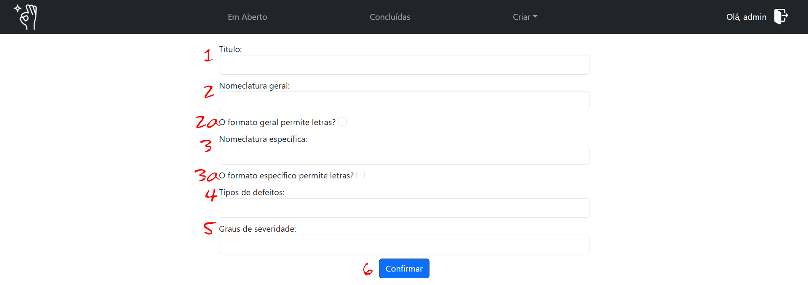

---
categories:
  - Artefato
---

# Artefato

Um tipo artefato é uma estrutura de dados base e reutilizavel que define a formatação de elementos como a localização, tipos de defeito e severidade, manipulando variáveis ao longo de todo o processo de inspeção. Por essa razão, embora não seja mandatório, é ideal que você esteja familiarizado com o processo antes de manipular o tipo de artefato.

> Os demais tutoriais, em especial o de [como criar uma inspeção](criar_inspecao.md), podem auxiliar nessa familiarização.

---

## Criando um Tipo de Artefato

Para iniciar o processo, acesse o menu _Criar > Artefato_ (elemento 4a da [barra de navegação](index.md#navegacao)). Isso irá te direcionar para a página de criação de um novo tipo de artefato:

### Título

> Elemento 1

É o nome que será definido para o novo tipo de artefato.

Ele deve ser único (literalmente, já que o sistema não aceita títulos existentes) e representar o artefato para o qual ele se aplica, visto que este será o identificador na hora de aplicá-lo em inspeções não só por você mas de qualquer usuário do sistema.

### Nomenclatura Geral

> Elemento 2

Denomina a forma de organização principal do artefato que ela representa. A exemplo: um aplicativo possui telas, um arquivo pdf possui páginas, etc.

Essa denominação tem caráter cosmético e não altera o processamento das informações, mas na exibição das informações durante todo o processo. Isto é: no formulário de submissão por parte do inspetor, na listagem de discrepâncias durante as etapas de coleção e discriminação por parte do monitor e no relatório final.

### Nomenclatura Específica

> Elemento 3

Denomina a forma de organização secundária do artefato que ela representa. A exemplo: as telas de um aplicativo possuem elementos, as páginas de um arquivo pdf possuem linhas, etc.

Funciona de maneira análoga à nomencratura geral e é utilizada como acessório a ela, formando a localização completa.

### Restrição Alfanumérica

Os elementos 2a e 3a são referentes à restrições alfanuméricas, no sentido de permitir ou não que os inspetores informem letras como parte das localizações geral ou específicas (respectivamente).

No entanto, embora esta alteração esteja prevista para atualizações futuras, o sistema não impede que o inspetor informe letras como parte da localização. A medida é portanto normativa, não restritiva.

### Tipos de Defeitos

> Elemento 4

É uma lista com possíveis defeitos relacionados às discrepâncias a serem registradas pelos inspetores durante o processo de detecção. Cada elemento da lista deve estar separado por ";", como a padrão: "Omissão; Fato incorreto; Ambiguidade; Informação Estranha; Informação inconsistente".

Embora a literatura defina as eurísticas da inspeção de software conforme citadas anteriormente, cada organização tem a liberdade de definir e operar segundo as próprias diretrizes, apenas garanta que toda a equipe está alinhada quanto a isso.

Os tipos de defeitos serão utilizados tanto de maneira cosmética como para processamento, por isso garanta que a formatação e grafia estão de acordo. <ins>Não</ins> é possível editar os dados depois de cadastrados.

> Por questões de acesso público e dependência estrutural no banco de dados, não há uma forma nativa de remover artefatos cadastrados. Revise as informações antes de realizar os cadastros.

> Em caso de ocorrência, contate o administrador do seu serviço.

### Graus de Severidade

> Elemento 5

São os níveis/categorias referentes à severidade/prioridade de uma discrepância já agrupada, e são utilizados pelo monitor durante o processo de discriminação.

Tem formatação e manipulação semelhantes aos tipos de defeitos, isto é, separação de listagem por ";" e utilização por seleção, mas em diferente contexto.

Assim como os tipos de defeitos, não são editáveis e podem diferir da norma na literatura. Quando este for o caso, é recomendado incluir a categoria "não defeito", "desconsiderar" ou semelhantes, já que (por lisura do processo) não é possível excluir discrepâncias.

### Confirmar

> Elemento 6

Este botão registra o novo artefato e o redireciona para a página home. Em caso de formatação incorreta ou informação ausente o sistema o notificará para que corrija os dados antes da submissão.

---

## Artefato Registrado

Ao concluir corretamente o registro do artefato, este estará disponível para uso na página de [criação de inspeção](naoexisteainda.md). Basta escolhe-lo no menu de seleção, com o título registrado.

Boa inspeção!