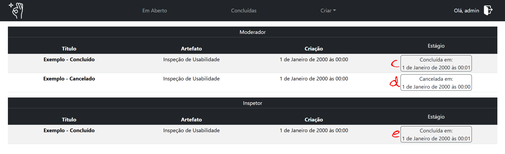

# Primeiros Passos

Este é um guia prático de como começar na ferramenta Inspecável.

---

## Acessando a Ferramenta

Infelizmente a ferramenta ainda não foi disponibilizada em um domínio público, por isso, para acessá-la você deve realizar a instalação. Você pode encontrar o passo a passo de como fazer isso no [Guia de Instalação](../instalacao.md).

Uma vez na plataforma você deve realizar o cadastro e login para ter acesso às funcionalidades. O processo de cadastro é simples e não requer confirmação de email, basta informar os campos requeridos e se certificar de recordar as informações de login.

Depois de cadastrado, você pode realizar o login utilizando o nome de usuário e senha e terá acesso às funcionalidades do sistema.

---

## Navegação

A principal ferramenta de navegação do site é o cabeçalho, que se encontra no topo da tela e conta com: 

1. A logo do sistema - direciona para o home
2. Em Aberto - direciona para a lista de inspeções não concluídas
3. Concluídas - direciona para a lista de inspeções finalizadas
4. Criar - abre o menu de navegação para:
    1. Artefato - direciona para a página de criação de tipos de artefatos
    2. Inspeção - direciona para a página de criação de inspeções
5. Nome de usuário - direciona para o menu de edição de informações do usuário.
6. Ícone de logout - realiza o logout da plataforma

O acesso às demais páginas e funcionalidades é específico e será feito conforme a necessidade.

### Listagem de Inspeções

As páginas de listagem de inspeções em aberto e concluídas são organizadas por moderador e inspetor de acordo com sua função na inspeção, as listadas em moderador sendo as que você criou e as em inspetor para as quais você foi atribuído, conforme mostrado a seguir.

---

---

1. O título é o nome que foi definido para a inspeção na sua criação e funciona como seu identificador.
2. O artefato indica o tipo de artefato referente à inspeção. (mais detalhes em [Artefatos](artefato_tutorial.md))
3. Carimbo de data/hora da criação da inspeção.
4. A etapa atual da inspeção, que pode variar conforme a sua função em relação a ela, sendo:
    1. Se você é _moderador_, esta recebe os status de `Detecção`, `Coleção` ou `Discriminação`, conforme seu estágio.
    2. Se você é _inspetor_, aqui ela só pode assumir o estágio de `Aberta`.
    3. Se você é _moderador_, ao finalizar a discriminação, a inspeção será marcada como concluída e registrará o carimbo de data/hora em que isso aconteceu.
    4. Se você é _moderador_, caso interrompa a inspeção em qualquer etapa, ela será marcada como cancelada e registrará o carimbo de data/hora em que isso aconteceu.
    5. Se você é _inspetor_, assim que o moderador encerrar o estágio de detecção, a inspeção será marcada como concluída para você, juntamente com o carimbo de data/hora em que isso aconteceu.
    6. Ainda, se você é _inspetor_ e uma inspeção for cancelada antes da conclusão do estágio de detecção, ela não ficará registrada para você.

---

## Proximos passos

Para uma compreensão mais ampla da ferramenta, nós recomendamos que você comece como monitor aprendendo como [criar uma inspeção](criar_inspecao.md).

Porém se os artefatos já registrados não atendem às suas necessidade, acompanhe o tutorial sobre [artefatos](artefato_tutorial.md).

Ainda, se você atuará apenas como inspetor e o monitor responsável é familiarizado com a ferramenta, você pode acompanhar apenas o tutorial para [inspetor](criar_inspecao.md).

---

#### __Importante!__

Embora a ferramenta auxilie na compreensão do processo de inspeção de usabilidade, os tutoriais não abordam diretamente a teoria formal do processo. Por isso, é altamente recomendado que você compreenda o processo antes de utilizar a ferramenta. Algumas fontes adequadas para essa compreensão são em sites como o da [EBAC](https://ebaconline.com.br/blog/teste-de-usabilidade) ou literaturas como o livro [Usability Inspection](https://www.researchgate.net/publication/337409059_Jakob_NIELSEN_and_Robert_L_MACK_Usability_Inspection_MethodNew_York_Wiley_1994_413_p), de Jakob Nielsen.